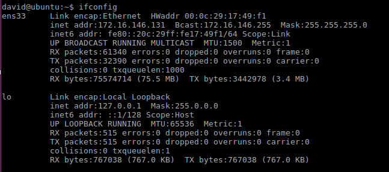
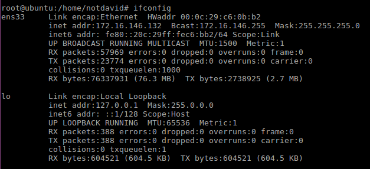
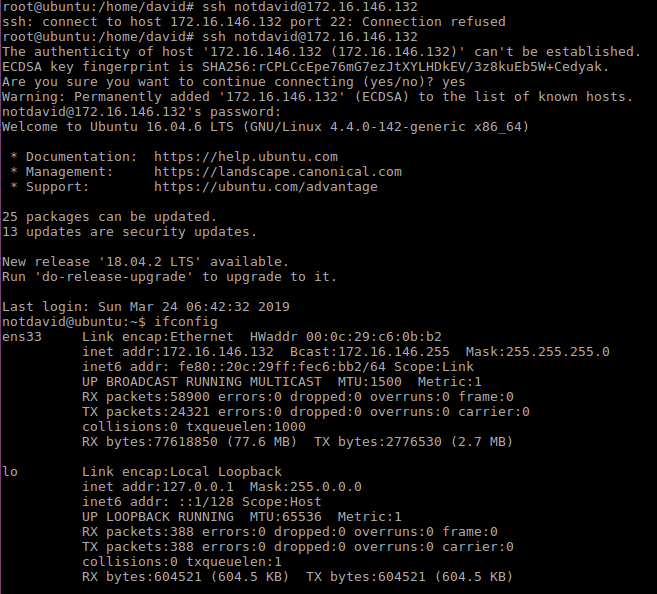
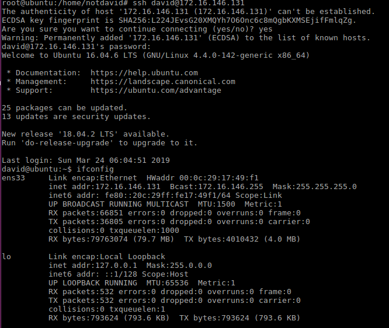
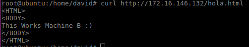
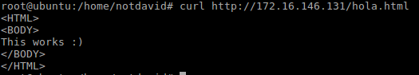

# Práctica 1. Preparación de las herramientas

## Cuestiones a resolver
*En esta práctica el objetivo es configurar las máquinas virtuales (al menos dos) para
trabajar en prácticas posteriores, asegurando la conectividad entre dichas máquinas.Como resultado de la práctica 1 se mostrarán dos máquinas funcionando al
profesor en clase (accesos con curl para solicitar páginas web sencillas, así como el
acceso por SSH entre ambas máquinas).*

### Específicamente, hay que llevar a cabo las siguientes tareas:
1. *Acceder por ssh de una máquina a otra*
2. *Acceder mediante la herramienta curl desde una máquina a la otra*

--------

##### Herammientas utilizada: *Vmware*

-------

### Maquina A
**IP:** 172.16.146.131
 

### Maquina B
**IP:** 172.16.146.132
 

## Conexiones SSH
Para acceder a una máquina por medio de *SSH*  basta con conocer su dirección IP y credenciales de acceso.
 
Conexión `ssh <user>@<ip>`

### SSH Maquina A a maquina B

### SSH Maquina B a maquina A

## Conexiones CURL
Comando `curl http://<ip>/hola.html`

### CURL maquina A a maquina B

### CURL maquina B a maquina A

