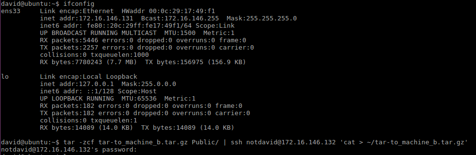
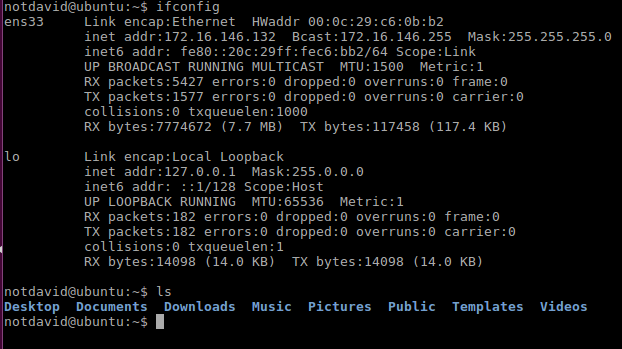
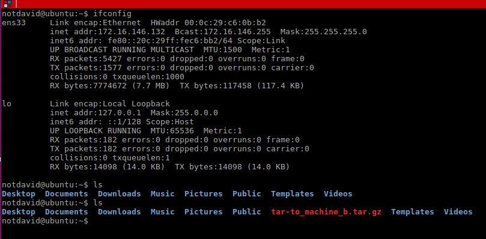

# Práctica 2. Clonar la información de un sitio web

### Objetivos

Los objetivos concretos de esta segunda práctica son:
 
- Aprender a copiar archivos mediante ssh
- Clonar contenido entre máquinas
- Configurar el ssh para acceder a máquinas remotas sin contraseña
- establecer tareas en cron

### Crear un tar con ficheros locales en un equipo
Lo que haremos sera crear desde la maquina A *172.16.146.131* un fichero *tar* y enviarlo a la maquina B *172.16.146.131*
esto lo realizamo con el siguiente comando:

`tar -zcvf tar-to_machine_b.tar.gz hola.py  | ssh 172.16.146.132 'cat > ~tar-to_machine_b.tar.gz`

##### Maquina A

##### Maquina B

##### Maquina B con data de Maquina A

