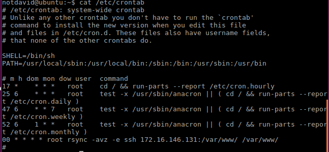

# Práctica 2. Clonar la información de un sitio web

### Objetivos

Los objetivos concretos de esta segunda práctica son:
 
- Aprender a copiar archivos mediante ssh
- Clonar contenido entre máquinas
- Configurar el ssh para acceder a máquinas remotas sin contraseña
- establecer tareas en cron

### Crear un tar con ficheros locales en un equipo
Lo que haremos sera crear desde la Máquina A *172.16.146.131* un fichero *tar* y enviarlo a la Máquina B *172.16.146.132*
esto lo realizamo con el siguiente comando:

`tar -zcvf tar-to_machine_b.tar.gz Public/ | ssh 172.16.146.132 'cat > ~/tar-to_machine_b.tar.gz`

##### Máquina A

##### Máquina B

##### Máquina B con data de Máquina A
Hemos cambiado los permisos por medio de `sudo chown david:david -R /var/www
`

### Rsync (Clonar contenido entre máquinas)
Vamos a clonar una carpeta cualquiera, primero tuvimos que cambiar el dueño de la carpeta por medio de este comando:
`sudo chown david:david /var/www`

##### Máquina A

##### Máquina B con data de Máquina A
Luego ejecutamos el comando: `rsync -avz -e ssh david@172.16.146.131:/var/www/ /var/www/` y observamos como realiza la copia los ficheros dentro de la carpeta /var/www.

Como podemos ver se ha copiado la carpeta sin ningún fallo.

### Configurar el ssh para acceder a máquinas remotas sin contraseña
Primero  generamos las llaves pública y privada de una de nuestras máquinas, en este caso MáquinaA.

##### Generación de clave y copia  Máquina A
Generación `ssh-keygen -b 4096 -t rsa` sin passphrase.

 
Copia: `ssh-copy-id 172.16.146.132`

##### Configuración ssh Máquina B
Hemos añadido la clave y cambiado los permisos por medio de `chmod 600 ~/.ssh/authorized_keys`.

Para las futuras conexiones, ya no hace falta introducir la contraseña.

### Programar tareas con crontab
Esta tarea debe ser realizada cada hora, por lo que debemos añadir a crontab (/etc/crontab) de la máquina B.
 
 Comando:`00 * * * * root rsync -avz -e ssh 172.16.146.131:/var/www/ /var/www/`

