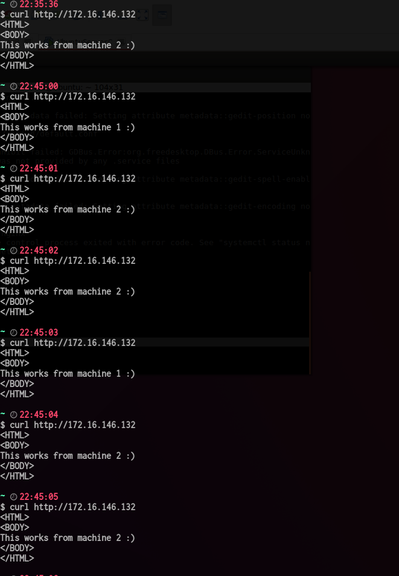
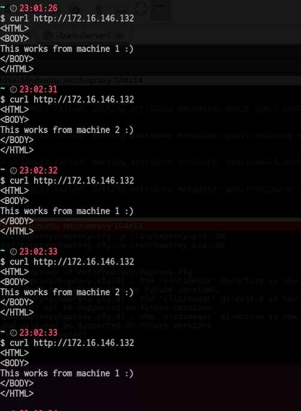
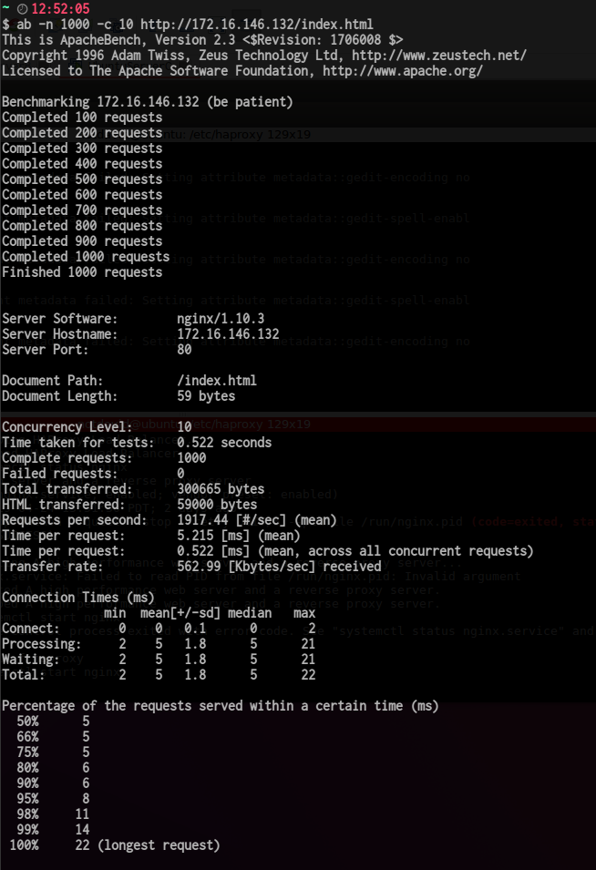
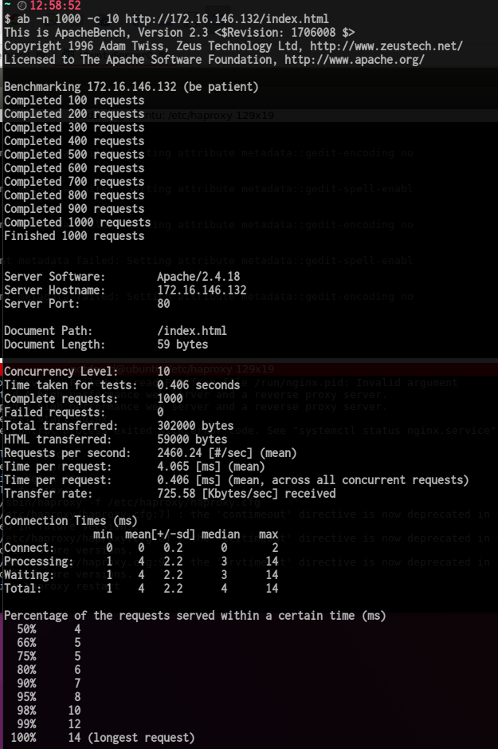

# Práctica 3. Balanceo de carga

### Objetivos
En esta práctica el objetivo es configurar las máquinas virtuales de forma que dos hagan de servidores web finales mientras que la tercera haga de balanceador de carga por software.
En esta práctica se llevarán a cabo, como mínimo, las siguientes tareas:
- Configurar una máquina e instalar el nginx como balanceador de carga
- Configurar una máquina e instalar el haproxy como balanceador de carga
- Someter a la granja web a una alta carga, generada con la herramienta Apache Benchmark, teniendo primero nginx y después haproxy.

### Nginx

Primero que todo, hemos añadido una nueva máquina *172.16.146.132* para instalar los balanceadores, se ha seguido el guión de la practica para la instalación de nginx y activación:

`sudo apt-get install nginx`
<br>
`sudo systemctl start nginx`

Para comprobar el status buscamos el proceso aunque, también se puede comprobar por medio de:
`sudo systemctl status nginx`


Tuvimos  que modificar el fichero de configuración ubicado en */etc/nginx/conf.d/default.conf*  y añadir las siguiente lineas.
```
upstream apaches {
  server 172.16.146.133;
  server 172.16.168.135;
}...
```
Ademas, modificamos los index de cada máquina para diferenciarlas.


Luego se ha modificado el peso de cada una de las maquinas, en este caso la segunda tiene un peso mayor, por lo tanto recibirá más peticiones.
```
upstream apaches {
  server 172.16.146.133 weight=1;
  server 172.16.168.135 weight=2;
}...
```


### Haproxy
Instalación `sudo apt-get install haproxy`.
Para seguir con la configuración, añadimos en el fichero */etc/haproxy/haproxy.cfg*
y añadir:
```
global
  daemon
  maxconn 256

defaults
  mode http
  contimeout 4000
  clitimeout 42000
  srvtimeout 43000

frontend http-in
  bind *:80
  default_backend servers

backend servers
  balance roundrobin
  server m1 172.16.146.133:80 maxconn 32
  server m2 172.16.146.135:80 maxconn 32
```
Para comprobar el funcionamiento: `sudo /usr/sbin/haproxy -f /etc/haproxy/haproxy.cfg`



### Someter a la granja web a una alta carga

En mi caso he tenido que instalar la herramienta de apache benchmark ya que no la tenía instalada.

`sudo apt-get install apache2-utils`

Ahora simplemente utilicé el comando:

`ab -n 1000 -c 10 http://172.16.146.132/index.html`
#### Nginx benchmark

#### Haproxy benchmark


Analizando estos tiempos claramente vemos que  Haproxy es mucho mas rápido, se ha tenido en cuenta, los timepos de ejecución tanto de petición, conexión, procesamiento etc. Además de Numero de peticiones por segundo y el numero total transferido.
