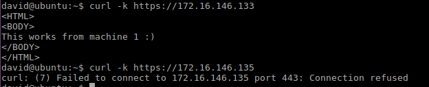

# Práctica 4. Seguridad

### Objetivos
El objetivo de esta práctica es llevar a cabo la configuración de seguridad de la granja
web. Para ello, llevaremos a cabo las siguientes tareas:

- Instalar un certificado SSL para configurar el acceso HTTPS a los servidores.
- Configurar las reglas del cortafuegos para proteger la granja web.

### Configuración HTTPS

Primero ejecutamos las siguientes instrucciones para activar el modulo de SSL de Apache.

`a2enmod ssl
service apache2 restart
mkdir /etc/apache2/ssl
openssl req -x509 -nodes -days 365 -newkey rsa:2048 -keyout
/etc/apache2/ssl/apache.key -out /etc/apache2/ssl/apache.crt`
 
Luego completamos los datos que necesita.

Editamos el archivo de configuración de SSL del sitio:

      nano /etc/apache2/sites-available/default-ssl.conf

Y agregamos estas lineas debajo de donde pone SSLEngine on:

      SSLCertificateFile /etc/apache2/ssl/apache.crt
      SSLCertificateKeyFile /etc/apache2/ssl/apache.key

Activamos el sitio default-ssl y reiniciamos apache:

      a2ensite default-ssl
      service apache2 reload

Para hacer peticiones por HTTPS utilizando la herramienta curl, ejecutaremos:

      curl -k https://172.16.146.133

Como se puede observar la máquina_a funciona correctamente, pero la b no, para estos vamos
configurar el balanceador para que también acepte este tráfico (puerto 443). Para
hacer esto, copiaremos la pareja de archivos (el .crt y el .key) a todas las máquinas de
la granja web. No debemos generar más certificados, sino que los archivos apache.crt
y apache.key que generamos en el primer servidor en el paso anterior vamos a
copiarlos al otro servidor y al balanceador.

Los copiamos usando rsync:

    sudo rsync -avz -e ssh david@172.16.146.133:/etc/apache2/ssl/* /etc/apache2/ssl
    sudo rsync -avz -e ssh david@172.16.146.133:/etc/apache2/sites-available/default-ssl.conf /etc/apache2/sites-available/
Realizamos petición:

      curl -k https://172.16.146.135

### Firewall

A continuación mostraremos cómo utilizar la herramienta para establecer ciertas
reglas y filtrar algunos tipos de tráfico, o bien controlar el acceso a ciertas páginas:
Toda a información sobre la herramienta está disponible en su página de manual y
usando la opción de ayuda:

    man iptables
    iptables –h

Primero comprobamos el estado del firewall:

    iptables –L –n -v

Teniendo en cuenta el script del guión de prácticas, he realizado los 3 primeros pasos para probar el acceso por medio de http y https.

    # (1) Eliminar todas las reglas (configuración limpia)
    iptables -F
    iptables -X
    iptables -Z
    iptables -t nat -F
    # (2) Política por defecto: denegar todo el tráfico
    iptables -P INPUT DROP
    iptables -P OUTPUT DROP
    iptables -P FORWARD DROP
    # (3) Permitir cualquier acceso desde localhost (interface lo)
    iptables -A INPUT -i lo -j ACCEPT
    iptables -A OUTPUT -o lo -j ACCEPT

    # (4) Abrir el puerto 22 para permitir el acceso por SSH
    iptables -A INPUT -p tcp --dport 22 -j ACCEPT
    iptables -A OUTPUT -p tcp --sport 22 -j ACCEPT
    # (5) Abrir los puertos HTTP (80) de servidor web
    iptables -A INPUT -p tcp --dport 80 -j ACCEPT
    iptables -A OUTPUT -p tcp --sport 80 -j ACCEPT

Ahora si podemos acceder por medio de http:

    # (6) Abrir los puertos HTTP (443) de servidor web
    iptables -A INPUT -p tcp --dport 443 -j ACCEPT
    iptables -A OUTPUT -p tcp --sport 443 -j ACCEPT

Ahora si podemos acceder por medio de https:
 
  

Como podemos la configuración esta completa,
 
  

ahora se otorgan permisos al script para añadirse al inicio de SO para que se ejecuté y configure las iptables.

  
